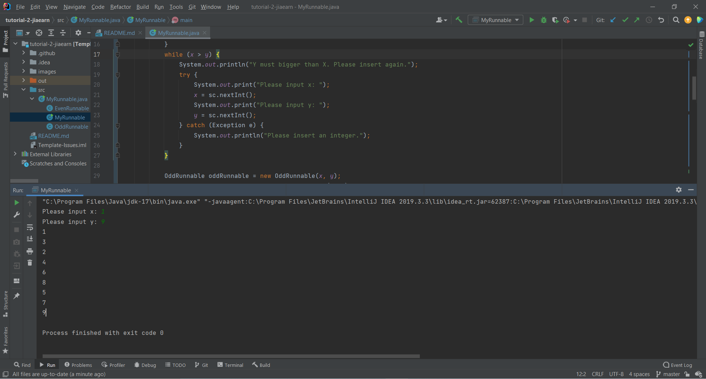

## Your Info:
1. Matric Number: 269509
2. Name: Tan Jia Earn

   

## Instruction:

1. Watch the video below:

   https://youtu.be/HMv5zszl40c

1. Then write a Java program to start __TWO (2)__ threads by `implementing Runnable` where:
    * 1st thread will display odd numbers between x to y.
    * 2nd thread will display even numbers between x to y.

1. x and y are integer numbers and MUST be input from the keyboard.

1. The program file which has the main method should be named `MyRunnable.java` and place in the `src` folder.

1. Screenshot the result and upload to this repo too.

1. Watch the video to clone, add, commit and push a repository to GitHub: https://youtu.be/RXV3Yusr0SI

## Example of the output
```
Please input x: 0
Please input y: 9

1
0
2
3
5
7
4
9
6
8
```

## Your Output/Result

 
